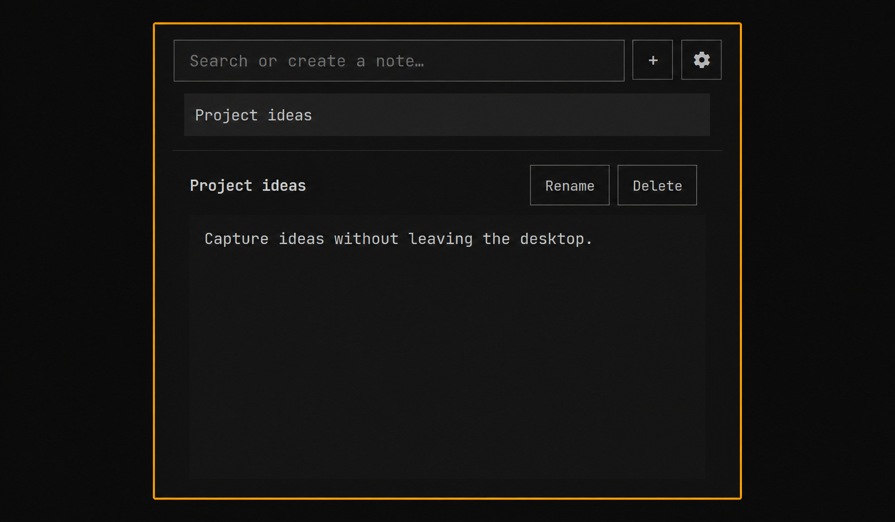

# Omarchy Notes

A compact Markdown notes plugin for the Omarchy bar. Search, create, edit,
rename, and delete notes without leaving the desktop.



## Features

- Instant search across note titles
- One-click creation with collision-safe `Untitled` names
- Debounced autosave for Markdown notes
- Inline rename with duplicate-name protection
- Confirmed deletion and right-click Rename/Delete actions
- Compact and comfortable editor sizes
- Keyboard-friendly panel navigation
- Notes stored as regular files in `~/Documents/Notes`

## Install

```bash
omarchy plugin add https://github.com/Gabzkk/Omarchy-notes-plugin.git --enable --yes
```

If the Notes widget is not already visible on the bar, add it with:

```bash
omarchy bar put burnz.notes
```

## Usage

- Left-click the Notes bar icon to open or close the panel.
- Type in the search field to filter notes or create a named note.
- Click `+` to create a new untitled note.
- Right-click a note title for Rename and Delete actions.
- Use the gear button to switch editor size.
- Notes autosave while you type.

## Development

Validate the manifest and run the model/file-operation tests:

```bash
omarchy plugin validate .
node NotesModel.test.js
```
